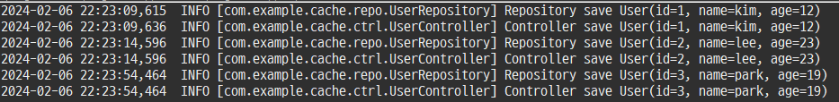
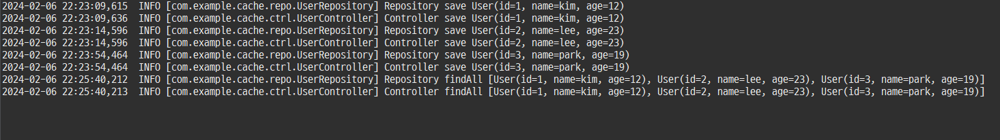
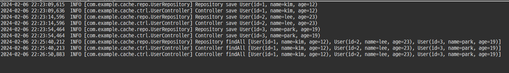
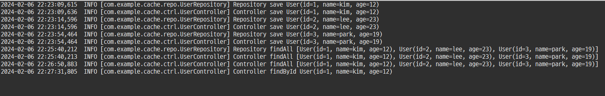
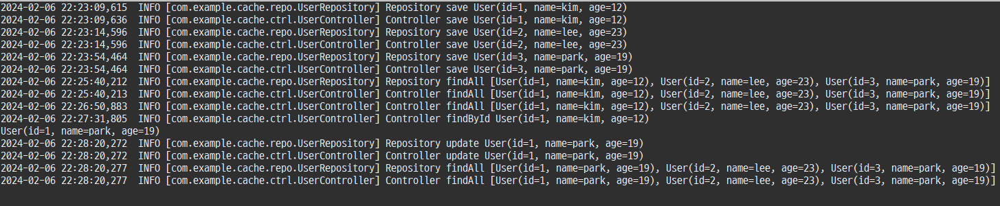

## 캐시(Cache)
---

캐시는 자주 사용하는 데이터나 값을 미리 복사해 놓는 임시 장소를 가리킨다. 동일한 요청이 들어오면 작업을 수행해서 결과를 만드는 대신 이미 보관된 결과를 돌려주는 방식을 말합니다.

> 출처 : https://mangkyu.tistory.com/69

캐시는 저장 공간이 작고 비용이 비싸지만 빠른 성능을 제공합니다. 하지만 저장공간이 작고 비용이 비싼만큼 모든 상황에서 쓸 수 있는 것은 아니다. 아래와 같은 경우에 사용을 고려하면 좋다.

-  반복적으로 동일한 결과를 돌려주는 작업 (이미지, 썸네일, 실시간 검색어 등)
-  잘 바뀌지 않는 정보를 외부에서 반복적으로 읽어오는 경우 (DB 데이터 호출 및 API 호출)

캐시는 CacheManager를 통해 메모리뿐만 아니라 디스크, 데이터베이스, 클라우드 서비스 등에 데이터를 저장하였다가 불러 사용한다. 엔터프라이즈급 어플리케이션에서 DBMS의 부하를 줄이고, 시간이 오래 걸리는 작업들에 대해 성능을 높일 수 있습니다. 캐시의 데이터가 변하는 시점에 맞춰 전략적으로 캐시를 사용하면 된다.

캐시는 오로지 성능을 위해서 자리를 잡고 있는 것이기 때문에 다른 것에 영향을 미쳐서는 안 된다. 다른 데이터가 바뀌어 버린다면 또 다른 비즈니스 로직이 되어버린다. 오로지 성능만을 위하기 때문에 다른 것에 영향을 미치지 않는다는 의미로 "투명하다"라는 말을 쓴다고 합니다.

## CacheManager 란?

* 캐시를 관리하고 캐시 된 데이터를 저장하고 반환하는 역할을 합니다.
* 일반적으로 메모리 상에 저장되는 데이터를 디스크, 데이터베이스, 클라우드 서비스와 같은 저장소에 저장이 가능하도록 합니다.
* 해당 캐시는 Redis, Ehcache, Caffeine등 다양한 캐시 라이브러리와 연동하여 사용 가능합니다.

> CacheManager의 종류

|CacheManager|캐시 저장 위치|설명|
|------------|-------------|-----|
|ConcurrentMapCacheManager|메모리 상에 캐시 저장|ConcurrentHashMap 기반 캐시 구현체를 의미합니다.|
|CaffeineCacheManager|메모리 상에 캐시 저장|Caffeine 기반 캐시 구현체|
|SimpleCacheManager|메모리 상에 캐시 저장|단순 캐시 구현체를 의미합니다.|
|EhCacheCacheManager|디스크 또는 데이터베이스에 저장|Ehcache 기반 캐시 구현체를 의미합니다.|
|HazelcastCacheManager|메모리 상에 캐시 저장|Hazelcast 기반 캐시 구현체를 의미합니다.|
|InfinispanCacheManager|메모리 상에 캐시 저장|Infinispan 기반 캐시 구현체를 의미합니다.|
|RedisCacheManager|Redis 내의 데이터베이스에 저장|Redis 기반 캐시 구현체를 의미합니다.|
|CouchbaseCacheManager|Couchbase 내의 데이터베이스에 저장|Couchbase 기반 캐시 구현체를 의미합니다.|
|GemfireCacheManager|자체 저장소에 저장|GemFire 기반 캐시 구현체를 의미합니다.|
|CoherenceCacheManager|자체 저장소에 저장|Oracle Coherence 기반 캐시 구현체를 의미합니다.|

## 어노테이션
---

### @EnableCaching

* Spring Boot에게 캐싱기능이 필요하다고 전달합니다
* Spring Boot Starter class에 적용

### @Cacheable

* 리턴 값을 기준으로 데이터가 캐시에 있으면 그대로 반환, 없으면 저장 후 반환합니다.
* 보통 조회와 같은 API에 많이 사용됩니다.

|Element|Description|Type|
|-------|-----------|----|
|cacheName|캐시이름(설정 메서드 리턴값이 저장)|String[]|
|value|cacheName의 별칭|String[]|
|key|동적인 키 값을 사용하는 SpEL 표현식 동일한 cache name을 사용하지만 구분될 필요가 있을 경우 사용되는 값|String|
|condition|SpEL 표현식이 참일 경우에만 캐싱 적용 - or, and 등 조건식, 논리 연산 가능|String|
|unless|캐싱을 막기 위해 사용되는 SpEL 표현식 condition과 반대로 참일 경우에만 캐싱이 적용되지 않음|String|
|cacheManager|사용 할 CacheManager 지정 (EHCacheManager, RedisCacheManager 등)|String|
|sync|여러 스레드가 동일한 키에 대한 값을 로드하려고 할 경우 기본 메서드의 호출을 동기화 즉, 캐시 구현체가 Thread safe 하지 않은 경우 캐시에 동기화를 걸 수 있는 속성|boolean|

### @CachePut

* 캐시에 데이터를 저장할 때만 사용된다.
* @Cacheable과 다르게 캐시에 저장된 데이터를 사용하지 않는다.
* 보통 수정과 같은 API에 많이 사용됩니다

|Element|Description|Type|
|-------|-----------|----|
|cacheName|입력할 캐시 이름|String[]|
|value|cacheName의 별칭|String[]|
|key|동적인 키 값을 사용하는 SpEL 표현식 동일한 cache name을 사용하지만 구분될 필요가 있을 경우 사용되는 값|String|
|cacheManager|사용 할 CacheManager 지정 (EHCacheManager, RedisCacheManager 등)|String|
|condition|SpEL 표현식이 참일 경우에만 캐싱 적용 - or, and 등 조건식, 논리 연산 가능|String|
|unless|캐싱을 막기 위해 사용되는 SpEL 표현식 condition과 반대로 참일 경우에만 캐싱이 적용되지 않음|String|

### @CacheEvict

* 메서드가 호출될 때 캐시에 있는 데이터가 삭제됩니다.
* 보통 삭제와 같은 API에 많이 사용됩니다.

|Element|Description|Type|
|-------|-----------|----|
|cacheName|제거할 캐시 이름|String[]|
|value|cacheName의 별칭|String[]|
|key|동적인 키 값을 사용하는 SpEL 표현식 동일한 cache name을 사용하지만 구분될 필요가 있을 경우 사용되는 값|String|
|allEntries|캐시 내의 모든 리소스를 삭제할지의 여부|boolean|
|condition|SpEL 표현식이 참일 경우에만 캐싱 적용 - or, and 등 조건식, 논리 연산 가능|String|
|cacheManager|사용 할 CacheManager 지정 (EHCacheManager, RedisCacheManager 등)|String|
|beforeInvocation|true - 메서드 수행 이전 캐시 리소스 삭제, false - 메서드 수행 후 캐시 리소스 삭제|boolean|

### @Caching

* 여러개의 캐시 어노테이션을 함께 사용하게 해줍니다.
* 예를들어 @CachePut과 @CacheEvict를 함께 사용할때 사용됩니다.

## 테스트
---

### 1. 새로운 유저 추가

3명의 유저를 추가합니다. 데이터 추가와 변경은 @CachePut을 사용하므로 매번 Repository 로그를 남깁니다. user::id 키값으로 해당 데이터를 캐싱합니다.

### 2. 첫 리스트 조회

첫 리스트 조회입니다. 캐싱된 데이터가 없으므로 Repository 로그를 남깁니다. user::all 키값으로 해당 데이터를 캐싱합니다.

### 3. 두번째 리스트 조회

두번째 리스트 조회입니다. user::all 키값으로 이미 데이터가 저장되어 있으므로 Repository 로그를 남기지 않습니다.

### 4. 유저 상세 조회

해당 유저의 상세 조회입니다. 유저 추가 과정에서 @CachePut 으로 user::1 가 이미 캐싱되어 있으므로 Repository 로그를 남기지 않습니다.

### 5. 유저 업데이트 후 조회

유저 업데이트 과정에서 members::all 이 evict 되어 다시 리스트 조회 Repository 까지 수행하게되어 로그를 남기게 됩니다.
