### Redis

> 빠른 오픈 소스 인 메모리 키 값 데이터 구조 스토어

보통 데이터베이스는 하드 디스크나 SSD에 저장한다. 하지만 Redis는 메모리(RAM)에 저장해서 디스크 스캐닝이 필요하지 않아 매우 빠르다.

캐싱도 가능하여 실시간 채팅에 적합하여 세션 공유를 위하여 세션 클러스터링에도 활용된다.

RAM은 휘발성이지만 이를 막기 위한 백업 과정이 존재한다.

- snapshot : 특정 지점을 설정하고 디스크에 백업
- AOF(Append Only File) : 명령(쿼리)들을 저장해두고, 서버가 셧다운되면 재 실행해서 다시 만들어 놓는 것

데이터 구조는 key/value 값으로 이루어져 있다. (따라서 Redis는 비정형 데이터를 저장하는 비관계형 데이터베이스(NoSQL) 관리 시스템이다.)

**Value 종류**

1. String (text, binary data) - 512MB까지 저장이 가능하다.
2. set (String 집합)
3. sorted set (set을 정렬해둔 상태)
4. Hash
5. List(양방향 연결리스트도 가능)

### 직렬화 / 역직렬화

1. JdkSerializationRedisSerializer

``JdkSerializationRedisSerializer``는 Default로 적용되는 Serializer로 기본 자바 직렬화 방식 사용

**단점**

-  SerialVersionUID 설정을 하지 않으면 클래스의 기본 해시값을 SerialVersionUID로 사용합니다. 따라서 클래스 구조가 조금이라도 변경 될 시 SerialVersionUID가 달라서 역직렬화에 실패 할 수 있습니다.
-  만약 개발자가 주의를 가지고 SerialVersionUID를 설정한다고 하여도 필드 타입이 변경되면 역시 역직렬화가 실패할 수 있습니다.
-  기본적으로 타입에 대한 정보 등 클래스 메타 정보들을 가지고 있기 때문 직렬화시 용량이 비대해진다.

2. GenericJackson2JsonRedisSerializer

``GenericJackson2JsonRedisSerializer``는 ClassType을 지정할 필요 없이 자동으로 객체 Json 형식으로 직렬화 해주는 장점이 있다. 하지만 직렬화된 데이터 Class Type을 포함하게 된다.

또한, 직렬화 시 @class 필드에는 해당 class의 패키지까지 함께 저장된다.  따라서, 어떤 Application 이던 해당 데이터를 꺼내오기 위해서는 해 루트, 경로에 같은 이름으로 해당 DTO Class를 생성해야만 사용이 가능해진다.

3. Jackson2JsonRedisSerializer

``Jackson2JsonRedisSerializer``는 @class 필드를 포함하지 않고 Json으로 저장해줍니다. 하지만 항상 Class Type정보를 Serializer에 함께 지정해주어야 합니다.

4. StringRedisSerializer

``StringRedisSerializer``는 String 값을 그대로 저장하는 Serializer이다.

### RedisCacheManager

1. INSERT

**CONSOLE**

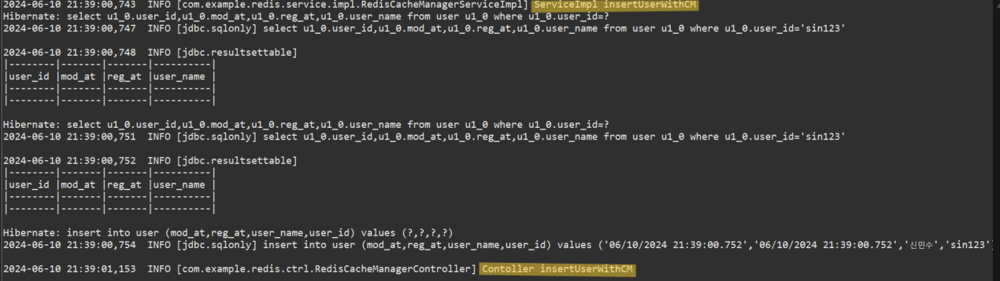

- ``sin123``, ``신민수`` DB 저장 및 ``sin123`` 키값으로 캐시 저장. @CachePut 실행결과를 RedisCache에 저장 항상 메서드의 로직을 실행한다. ``all`` 캐시가 있다면 삭제

**REDIS_CLI**

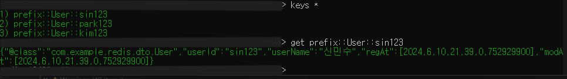

- 전체 키 값 조회 이후 ``sin123`` 키 값 내부 정보 조회

2. GETLIST

**CONSOLE**

- 첫 조회시 ``all`` 키 값에 조회된 리스트 저장. 조회 당시 해당 키 값이 없는 상태이기 때문에 ServiceImpl 까지 수행

**REDIS_CLI**

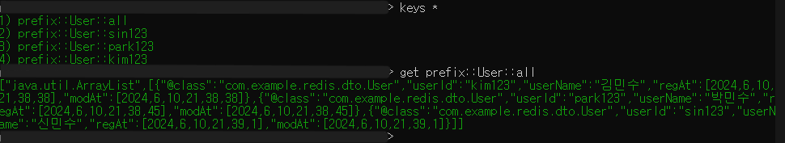

- 전체 키 값 조회 이후 ``all`` 키 값 내부 리스트 정보 조회

**CONSOLE 2**

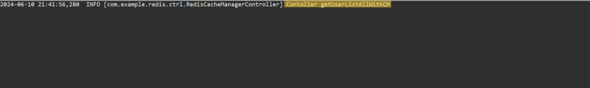

- 두번째 조회시 ServiceImpl을 거치지 않고 캐시에 저장된 리스트 정보 조회

3. GETDETAIL

**CONSOLE**

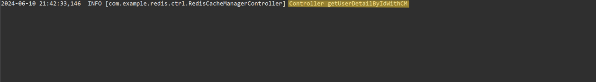

- ``sin123`` 키 값은 INSERT 과정에서 저장되었으므로 ServiceImpl 수행하지 않고 캐시에 저장된 정보 조회

4. UPDATE

**CONSOLE**

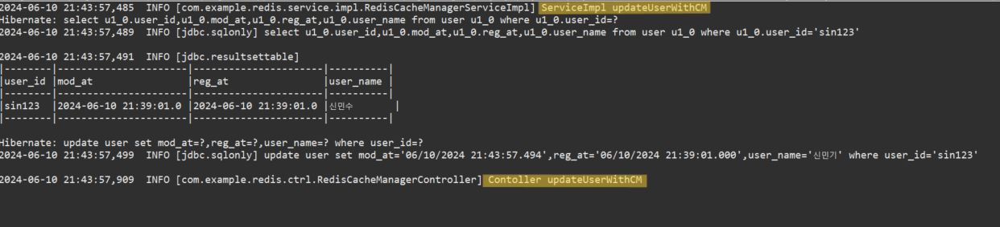

- ``sin123`` 유저 이름 From ``신민수`` To ``신민기`` @CachePut 실행결과를 RedisCache에 저장 항상 메서드의 로직을 실행한다. ``all`` 캐시가 있다면 삭제

**REDIS_CLI**

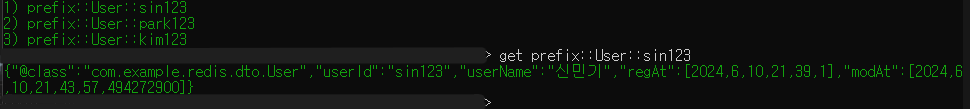

- 전체 키 값 조회 이후 ``sin123`` 수정된 내부 정보 조회

5. DELETE

**CONSOLE**

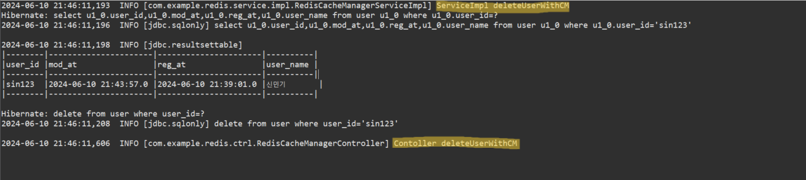

- ``sin123`` 키 값을 삭제 @CachePut 실행결과를 RedisCache에 저장 항상 메서드의 로직을 실행한다. ``all`` 캐시가 있다면 삭제

**REDIS_CLI**

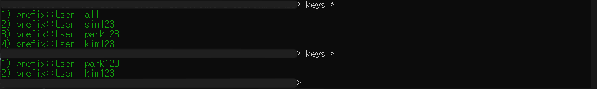

- 삭제 이전 전체 키 값 -> 삭제 이후 전체 키 값

### RedisTemplate

**HASH로 저장**

1. INSERT

**REDIS_CLI**

- Movie 키 값에 필드 값 ``A123``, ``B123`` 저장 후 전체 키 조회 후 해당 Movie 키 조회

2. GETLIST

**CONSOLE**

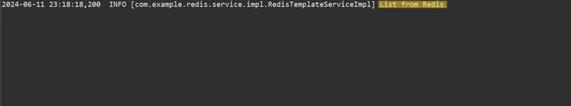

- Movie 키 값 엔트리를 조회하였을 때 데이터가 존재하여 DB가 아닌 REDIS를 통하여 조회

3. GETDETAIL

**CONSOLE**

- ``B123`` 필드 값을 조회하였을 때 데이터가 존재하여 DB가 아닌 REDIS를 통하여 조회

4. UPDATE

**REDIS_CLI**

- ``B123`` 필드의 movieName을 From ``개미`` To ``개미굴`` 로 변경
- Movie 키 값을 재 조회

5. DELETE

**REDIS_CLI**

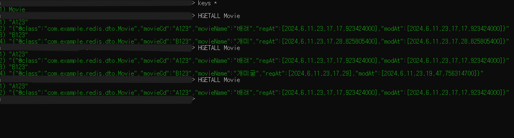

- ``B123`` 필드를 삭제
- Movie 키 값을 재 조회
